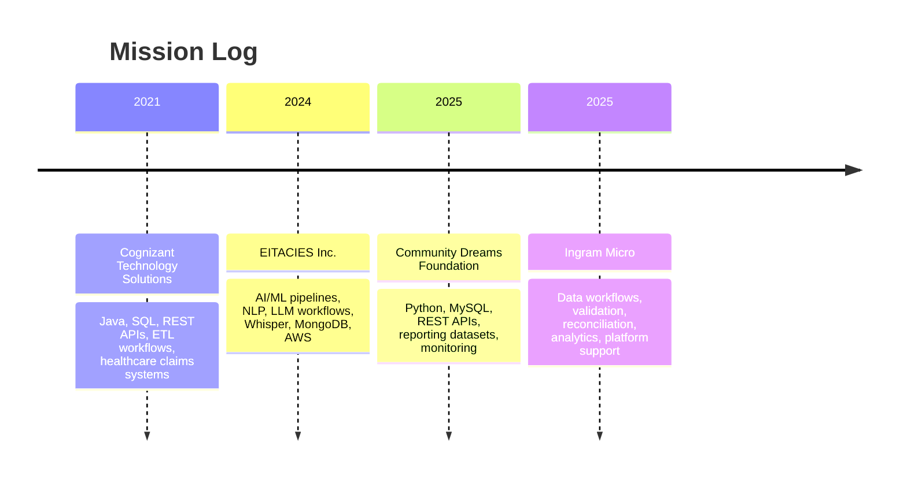

 

---

## 🧠 Mission Control

<table>
<tr>
<td align="center" width="33%">

### 🧩 Role Matrix

 

 

</td>
<td align="center" width="34%">

### ⚙️ Core Engine

 

 

</td>
<td align="center" width="33%">

### 🚀 Current Focus

 

 

</td>
</tr>
</table>

<table>
<tr>
<td align="center" width="25%">

 
<b>Data Platform Specialist</b>
</td>
<td align="center" width="25%">

 
<b>University at Buffalo</b>
</td>
<td align="center" width="25%">

 
<b>AI • Data • Backend</b>
</td>
<td align="center" width="25%">

 
<b>Build • Scale • Ship</b>
</td>
</tr>
</table>

I build **Python and SQL-driven data pipelines, backend services, AI/ML workflows, dashboard-ready datasets, and cloud-based data applications**. My work connects operational data, production systems, machine learning workflows, and business reporting into reliable solutions that teams can actually use.

---

## 🏅 Certification Badge Wall

---

## ⚡ Skills Matrix

<table>
<tr>
<td align="center" width="25%">

  

  

</td>
<td align="center" width="25%">

  

  

</td>
<td align="center" width="25%">

  

  

</td>
<td align="center" width="25%">

  

  

</td>
</tr>
</table>

---

## 🛰️ Career Timeline

---

## 💼 Experience Cards

<table>
<tr>
<td width="50%">

### 🏢 Ingram Micro
**Data Platform Specialist**

- Scalable workflows for ERP, supply-chain, quote, order-management, and transaction data.
- Python and SQL components for ingestion, validation, transformation, reconciliation, and exception handling.

</td>
<td width="50%">

### 🌱 Community Dreams Foundation
**Software Developer**

- End-to-end data pipelines for donor, transaction, and operational data.
- REST API integrations for reporting applications, backend services, and AI-driven workflows.

</td>
</tr>
<tr>
<td width="50%">

### 🧠 EITACIES Inc.
**AI/ML Intern**

- Python-based AI pipelines for NLP, LLM, prompt-based applications, and unstructured text/audio data.
- Whisper transcription to convert audio streams into structured text for analytics and AI consumption.

</td>
<td width="50%">

### 🏥 Cognizant Technology Solutions
**Programmer Analyst**

- Backend data services using Java, SQL, REST APIs, and enterprise integration workflows.
- Healthcare and insurance claims datasets for reporting, analytics, data retrieval, and business applications.

</td>
</tr>
</table>