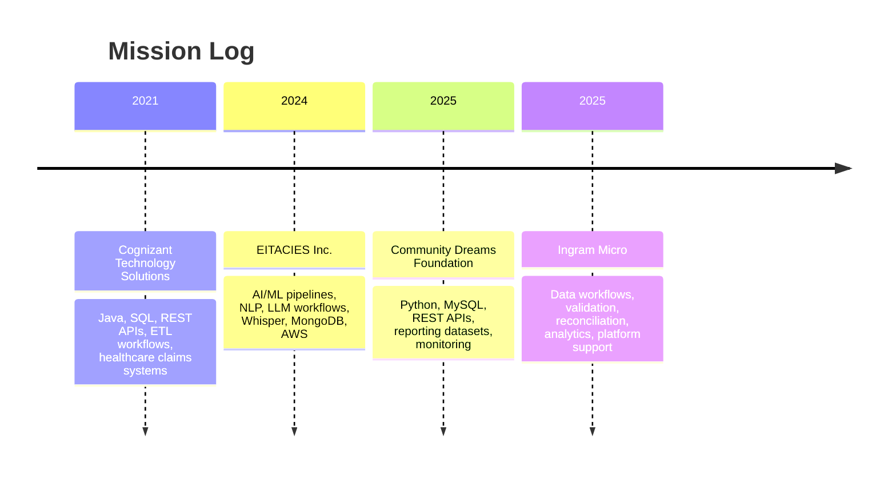

<div align="center">


<br/>

<a href="https://github.com/pvssunilbhattar">
  
</a>


</div>

---

## 🧠 Mission Control

<table>
<tr>
<td width="55%">

```txt
┌──────────────────────────────────────────────┐
│ AI / DATA / BACKEND COMMAND CENTER           │
├──────────────────────────────────────────────┤
│ Role      : Software Engineer | AI/Data Eng  │
│ Current   : Data Platform Specialist         │
│ Degree    : M.S. Data Science, UB            │
│ Stack     : Python, SQL, PySpark, Java, AWS  │
│ Focus     : LLM Apps, RAG, APIs, Pipelines   │
│ Mission   : Turn raw data into intelligence  │
└──────────────────────────────────────────────┘
```

</td>
<td width="45%" align="center">


</td>
</tr>
</table>

I build **Python and SQL-driven data pipelines, backend services, AI/ML workflows, dashboard-ready datasets, and cloud-based data applications**. My work connects operational data, production systems, machine learning workflows, and business reporting into reliable solutions that teams can actually use.

---

## ⚡ Animated Skill Grid

<div align="center">

<table>
<tr>
<td align="center" width="25%">

<br/>

<br/>


</td>
<td align="center" width="25%">

<br/>

<br/>


</td>
<td align="center" width="25%">

<br/>

<br/>


</td>
<td align="center" width="25%">

<br/>

<br/>


</td>
</tr>
</table>

</div>

---

## 🔥 Skill Power Bars

<table>
<tr>
<td width="50%">

### Data + Backend Core

  
  
  
  


</td>
<td width="50%">

### AI + Cloud Layer

  
  
  
  


</td>
</tr>
</table>

---

## 🛰️ Career Timeline



---

## 💼 Experience Cards

<table>
<tr>
<td width="50%">

### 🏢 Ingram Micro
**Data Platform Specialist**


- Scalable workflows for ERP, supply-chain, quote, order-management, and transaction data.
- Python and SQL components for ingestion, validation, transformation, reconciliation, and exception handling.

</td>
<td width="50%">

### 🌱 Community Dreams Foundation
**Software Developer**


- End-to-end data pipelines for donor, transaction, and operational data.
- REST API integrations for reporting applications, backend services, and AI-driven workflows.

</td>
</tr>
<tr>
<td width="50%">

### 🧠 EITACIES Inc.
**AI/ML Intern**


- Python-based AI pipelines for NLP, LLM, prompt-based applications, and unstructured text/audio data.
- Whisper transcription to convert audio streams into structured text for analytics and AI consumption.

</td>
<td width="50%">

### 🏥 Cognizant Technology Solutions
**Programmer Analyst**


- Backend data services using Java, SQL, REST APIs, and enterprise integration workflows.
- Healthcare and insurance claims datasets for reporting, analytics, data retrieval, and business applications.

</td>
</tr>
</table>

---

## 🧪 Featured Project Dashboard

<table>
<tr>
<td width="50%">

### 🏨 Hospitality Management System
**Python • PL/SQL • AWS RDS • Lambda • S3 • ETL**


Built an end-to-end hotel operations system for reservations, guest management, room inventory, reporting, normalized schema design, and scalable AWS-backed workflows.

</td>
<td width="50%">

### 🌐 Big Data Analysis & Optimization
**Hadoop • MapReduce • PySpark • Data Mining**


Processed large-scale text data, optimized word count performance, reduced mapper output by 41%, and implemented PageRank using PySpark distributed systems.

</td>
</tr>
<tr>
<td width="50%">

### 🔐 AI Classification Pipelines
**Python • NLP • TF-IDF • Logistic Regression • Naive Bayes • MongoDB**


Built ML workflows for preprocessing, feature extraction, classification, model evaluation, and structured AI output storage.

</td>
<td width="50%">

### 📈 Real-Time Stock Engine
**Python • Backend Logic • Order Matching • Concurrency**


Designed a real-time trading engine simulation with order matching, ticker-based transactions, and backend-focused system design logic.

</td>
</tr>
</table>

---

## 🧬 AI Enhancement Layer

```txt
┌──────────────────────────── AI EXTENSION BOARD ─────────────────────────────┐
│ Resume + Job Match Assistant     → GPT-powered ATS tailoring                │
│ Hospitality Analytics Assistant  → Natural language business insights        │
│ Model Explanation Layer          → AI-generated prediction explanations      │
│ Trading Log Analyzer             → AI summary of simulated activity          │
│ Interview Prep Agent             → Resume + JD based spoken answer builder   │
│ Data Quality Copilot             → Explains validation failures and patterns │
└──────────────────────────────────────────────────────────────────────────────┘
```

---

## 📊 GitHub Performance Board

<div align="center">


</div>

---

## 🎓 Certification Console

<div align="center">


</div>

---

## 🌌 Contribution Activity

<div align="center">


</div>

---

<div align="center">


</div>
