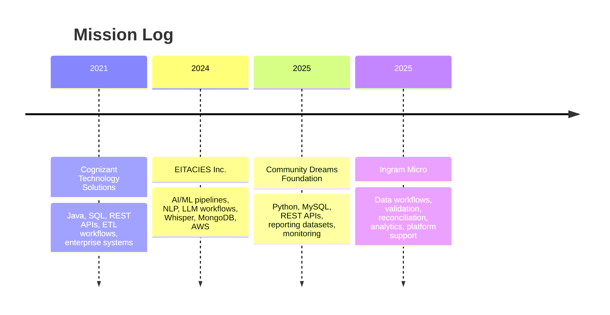

<div align="center">


<br/>

<a href="https://github.com/pvssunilbhattar">
  
</a>


</div>

---

## 🧠 AI / Data Engineering Command Center

```txt
┌──────────────────────────────────────────────────────────────────────────────┐
│ PROFILE DASHBOARD                                                            │
├──────────────────────────────────────────────────────────────────────────────┤
│ Role        : Software Engineer | AI/Data Engineer | Data Platform Builder   │
│ Education   : M.S. Engineering Science - Data Science, University at Buffalo │
│ Focus       : Python, SQL, PySpark, REST APIs, LLM Apps, RAG, NLP, AWS       │
│ Strength    : Building production-ready data, AI, backend, and cloud systems │
└──────────────────────────────────────────────────────────────────────────────┘
```

I build **Python and SQL-driven data pipelines, backend services, AI/ML workflows, dashboard-ready datasets, and cloud-based data applications**. My work focuses on transforming raw operational data into reliable systems for analytics, automation, machine learning, and business intelligence.

---

## ⚡ Tech Stack

<div align="center">


</div>

---

## 🚀 What I Build

<table>
<tr>
<td width="50%">

### 🤖 AI + LLM Systems
- LLM applications and prompt engineering
- RAG-ready workflows and AI automation
- NLP pipelines and text classification
- Model evaluation and performance analysis
- Whisper-based audio transcription

</td>
<td width="50%">

### 📊 Data Engineering
- ETL/ELT pipeline development
- Python and SQL data workflows
- PySpark processing and optimization
- Data validation and reconciliation
- Dashboard-ready analytics datasets

</td>
</tr>
<tr>
<td width="50%">

### ☁️ Cloud + DevOps
- AWS S3, Lambda, and RDS
- Azure data platform concepts
- GitHub Actions and CI/CD
- Jenkins deployment support
- Prometheus and Grafana monitoring

</td>
<td width="50%">

### 🧩 Backend + Integration
- REST API development
- Java backend services
- Spring Boot and Hibernate
- SQL transformation logic
- Enterprise workflow integrations

</td>
</tr>
</table>

---

## 🛰️ Career Timeline



---

## 🧪 Featured Project Dashboard

<table>
<tr>
<td width="50%">

### 🏨 Hospitality Management System
**Tech:** Python, PL/SQL, AWS RDS, Lambda, S3, ETL, Data Normalization

Built an end-to-end hotel operations system covering reservations, guest management, room inventory, reporting, normalized schema design, and scalable AWS-backed data workflows.

</td>
<td width="50%">

### 🌐 Big Data Analysis & Optimization
**Tech:** Hadoop, MapReduce, PySpark, Data Mining

Processed large-scale text data, optimized word count performance, reduced mapper output by 41%, and implemented PageRank using PySpark distributed systems.

</td>
</tr>
<tr>
<td width="50%">

### 🔐 AI Classification Pipelines
**Tech:** Python, NLP, TF-IDF, Logistic Regression, Naive Bayes, MongoDB

Built machine learning workflows for text classification, preprocessing, feature extraction, model evaluation, and structured output storage.

</td>
<td width="50%">

### 📈 Real-Time Stock Engine
**Tech:** Python, Backend Logic, Order Matching, Concurrency

Designed a real-time trading engine simulation with order matching, ticker-based transactions, and backend-focused system design logic.

</td>
</tr>
</table>

---

## 🧬 AI Enhancement Layer

```txt
┌──────────────────────────── AI EXTENSION BOARD ─────────────────────────────┐
│ Resume + Job Match Assistant     → GPT-powered ATS tailoring                │
│ Hospitality Analytics Assistant  → Natural language business insights        │
│ Model Explanation Layer          → AI-generated prediction explanations      │
│ Trading Log Analyzer             → AI summary of simulated activity          │
│ Interview Prep Agent             → Resume + JD based spoken answer builder   │
└──────────────────────────────────────────────────────────────────────────────┘
```

---

## 📊 GitHub Performance Board

<div align="center">


</div>

---

## 🎓 Certifications

<div align="center">


</div>

---

## 🌌 Contribution Activity

<div align="center">


</div>

---

<div align="center">

```txt
Build clean. Scale smart. Explain clearly. Ship reliably.
```


</div>
